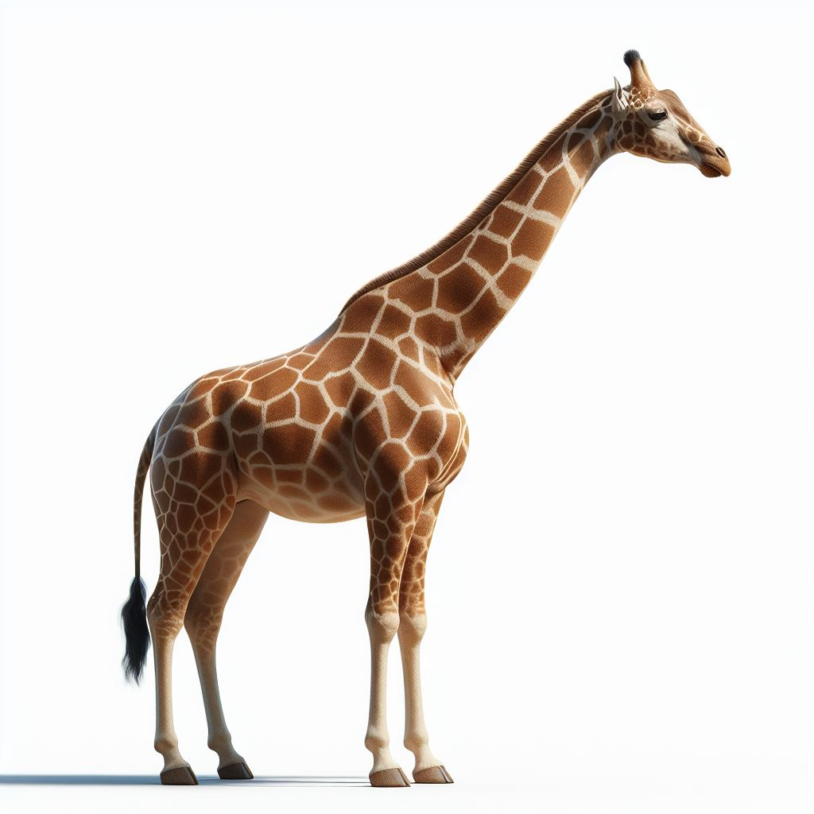
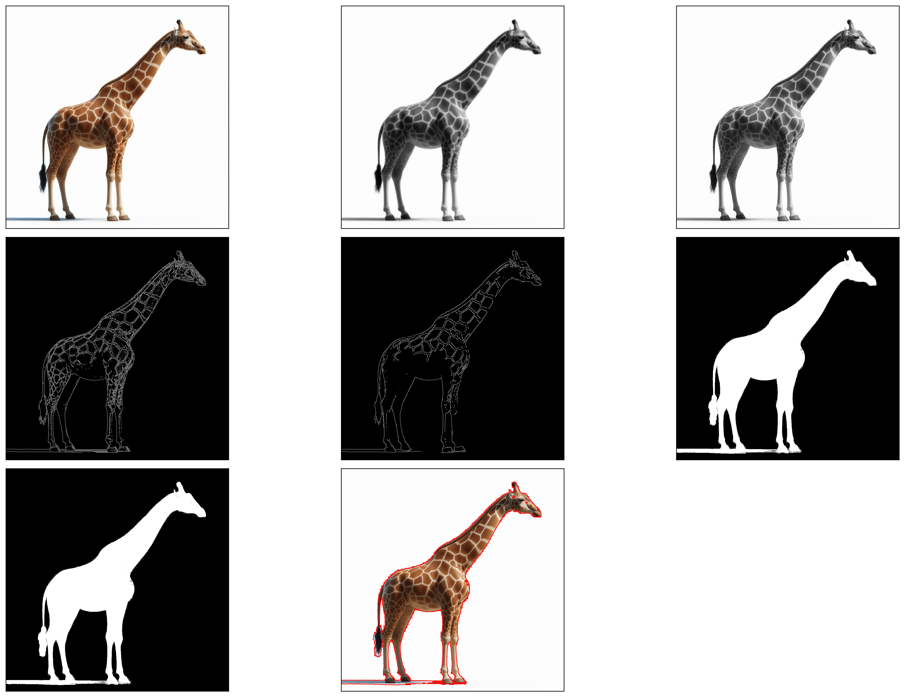
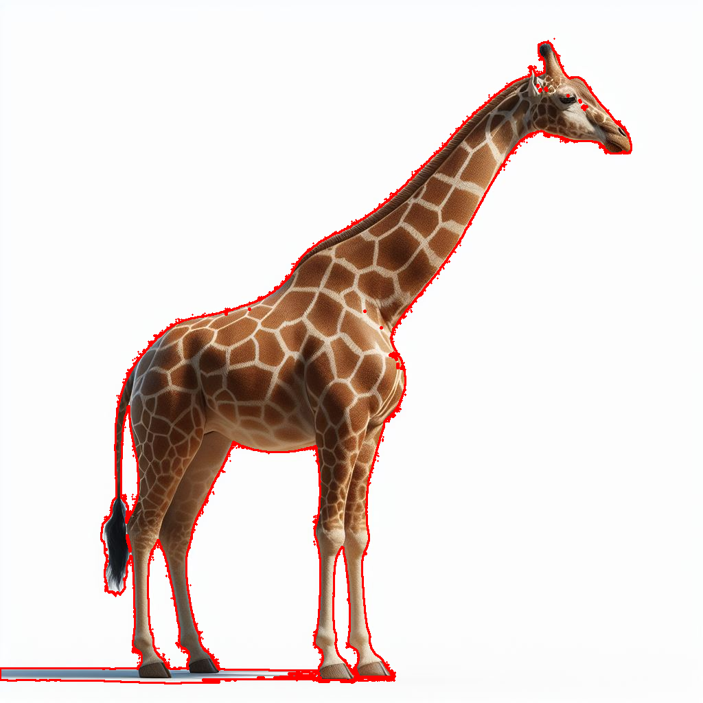
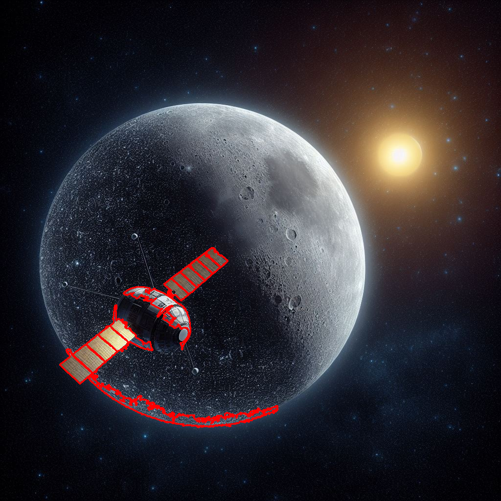

# Relatório: Extração de Bordas com OpenCV

## Objetivo

A atividade de laboratório tem como objetivo aplicar técnicas de **visão computacional** utilizando o OpenCV para extrair as bordas de objetos presentes em três imagens distintas. Para isso, foram utilizadas operações **morfológicas**, **binarização**, **detecção de bordas com Canny** e **extração de contornos**.

As imagens analisadas foram:
- Um avião (`Aviao.jpeg`)
- Uma girafa (`Girafa.jpeg`)
- Um satélite (`Satelite.jpeg`)

## Descrição Geral do Código

O script `contorno.py` utiliza a biblioteca OpenCV para aplicar uma sequência de operações clássicas de processamento de imagens, com o objetivo de evidenciar e extrair os contornos dos objetos principais em três imagens diferentes. A seguir, detalhamos o passo a passo do processo aplicado a cada imagem:

1. **Leitura e conversão de cor:**
   - A imagem é lida com `cv2.imread()` e convertida de BGR (padrão OpenCV) para RGB com `cv2.cvtColor()`, garantindo a visualização correta das cores em bibliotecas como `matplotlib`.
   - Em seguida, ela é convertida para **escala de cinza** usando `cv2.COLOR_RGB2GRAY`, pois a maioria das operações de borda e binarização são mais eficazes com apenas um canal de intensidade.

2. **Binarização:**
   - A imagem em tons de cinza é submetida à binarização com a função `cv2.threshold()`, transformando-a em uma imagem preta e branca.
   - O limiar é definido com base em um valor fixo ou proporcional ao brilho máximo da imagem, permitindo **diferenciar o fundo dos objetos de interesse**.
   - O modo `cv2.THRESH_BINARY_INV` inverte os tons: objetos claros ficam pretos e fundo escuro vira branco — ideal para extrair contornos externos com `cv2.findContours()` posteriormente.

3. **Criação do kernel morfológico:**
   - Um kernel retangular (estrutura de pixels) é criado com `np.ones((k, k), np.uint8)` onde `k` é o tamanho definido nos parâmetros.
   - Esse kernel será usado nas operações morfológicas subsequentes.

4. **Operações morfológicas (opcional):**
   - Caso habilitadas, são aplicadas três operações morfológicas:
     - `cv2.morphologyEx(..., cv2.MORPH_CLOSE, ...)`: fecha pequenos buracos internos nos objetos.
     - `cv2.dilate()`: expande as bordas brancas, ajudando a conectar regiões fragmentadas.
     - `cv2.morphologyEx(..., cv2.MORPH_OPEN, ...)`: remove pequenos ruídos isolados do fundo.
   - Essas operações **preparam a imagem binarizada para uma melhor extração de contornos**, eliminando falhas causadas por imperfeições na binarização.

5. **Desfoque (blur):**
   - A imagem em tons de cinza é suavizada com `cv2.blur()` para reduzir ruídos de alta frequência que podem interferir na detecção de bordas.
   - Essa suavização é importante para **evitar a detecção de contornos falsos ou pixelados**.

6. **Detecção de bordas com Canny:**
   - A função `cv2.Canny()` é aplicada duas vezes:
     - Uma na imagem original em cinza.
     - Outra na imagem suavizada.
   - O algoritmo de Canny detecta **regiões com variações abruptas de intensidade**, que são tipicamente associadas às bordas de objetos.

7. **Extração de contornos:**
   - Utilizando `cv2.findContours()`, os contornos são extraídos da imagem binarizada (ou da versão morfologicamente tratada).
   - Dependendo da imagem, é escolhido o modo `cv2.RETR_TREE` (hierárquico) ou `cv2.RETR_EXTERNAL` (apenas contornos externos).
   - Os contornos são então **filtrados por área** (caso os parâmetros definam um valor mínimo e máximo), para remover ruídos ou detalhes irrelevantes.

8. **Desenho dos contornos finais:**
   - Os contornos selecionados são desenhados sobre uma cópia colorida da imagem original com `cv2.drawContours()`, utilizando a cor azul (255, 0, 0).
   - Essa imagem final destaca visualmente os contornos dos objetos de interesse.

9. **Visualização e salvamento:**
   - Todas as imagens intermediárias (cinza, borrada, binarizada, Canny, etc.) são salvas em uma única figura com `matplotlib`, permitindo a **visualização completa do pipeline de processamento**.
   - A imagem final, contendo apenas os contornos desenhados, também é salva separadamente com alta resolução.

---

## Extração de Bordas: Avião

### Imagem Original

### Processamento e Etapas Intermediárias

### Imagem Final (Contornos Detectados)

### Parâmetros Utilizados
- Limiar de binarização: `0.4 * valor máximo da imagem em cinza`
- Kernel: `5x5`
- Operações morfológicas: `Sim (close, dilate, open)`
- Filtros Canny: `threshold1 = 0.5*a`, `threshold2 = 0.5*a`
- Área mínima de contorno: `5000`
- Área máxima de contorno: `100000`

---

## Extração de Bordas: Girafa

### Imagem Original

### Processamento e Etapas Intermediárias

### Imagem Final (Contornos Detectados)

### Parâmetros Utilizados
- Limiar de binarização: `10`
- Kernel: `5x5`
- Operações morfológicas: `Não`
- Filtros Canny: `threshold1 = 0.5*a`, `threshold2 = 0.5*a`
- Sem filtro de área de contorno

---

## Extração de Bordas: Satélite

### Imagem Original

### Processamento e Etapas Intermediárias

### Imagem Final (Contornos Detectados)

### Parâmetros Utilizados
- Limiar de binarização: `lambda a: (a * 50) * 0.3`
- Kernel: `5x5`
- Operações morfológicas: `Não`
- Filtros Canny: `threshold1 = 0.5*a`, `threshold2 = 0.5*a`
- Área mínima de contorno: `500`
- Área máxima de contorno: `20000`
